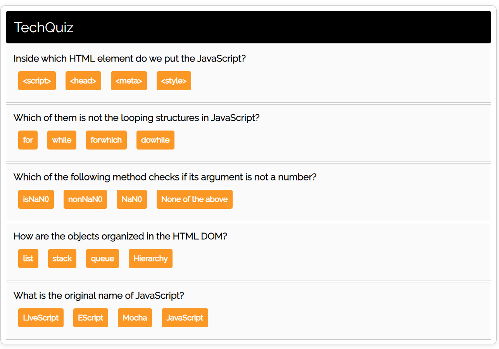

                                                     
<h2 align="center">TechQuiz</h2>

<h1 align="center">
	
</h1>  
<h2>Introduction</h2>
<p>TechQuiz is base on javaScript multiple choice questions and answers.</p>

<h2>Technologies</h2>
<ul>
<li>Reactjs</li>
</ul>

<h2>How to Launch</h2>

To clone and run this application, From your command line:

```bash
# Clone this repository
$ git clone https://github.com/ganesh1172/tech-quiz.git

#install package
$ npm install

#run program using
$ npm start
```

## Support

Show some :heart: and star the repo to support the project. Demo version:- https://javascript-techquiz.netlify.app/


